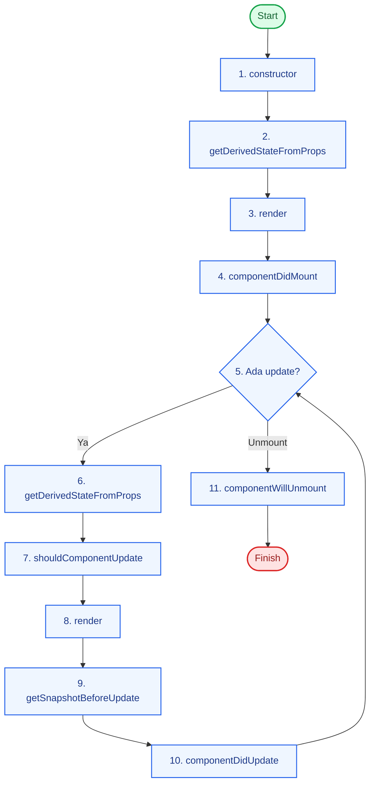

# Class Component Lifecycle

Panduan ringkas lifecycle pada class component React.

## Urutan Dasar

1. Mounting
2. Updating
3. Unmounting
4. Error Handling (Error Boundary)

## Diagram Alur

## Mapping Cepat ke Hooks

| Class Lifecycle | Function Hooks |
| --- | --- |
| `componentDidMount` | `useEffect(..., [])` |
| `componentDidUpdate` | `useEffect(..., [deps])` |
| `componentWillUnmount` | cleanup pada `useEffect` |
| `shouldComponentUpdate` | `React.memo` / `useMemo` / `useCallback` |

## Catatan Praktis

- `render()` harus pure, tanpa side effect.
- Cleanup wajib di `componentWillUnmount()`.
- Gunakan class lifecycle jika memang butuh class component legacy.
