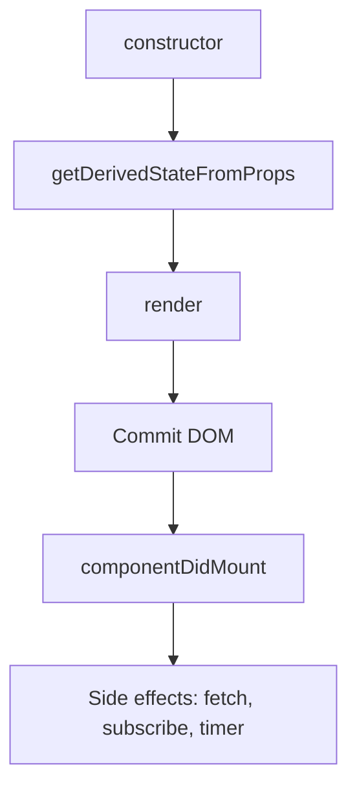

# Mounting Lifecycle (Class Component)

Fase mounting terjadi saat class component pertama kali dibuat dan dipasang ke DOM.

## Urutan Mounting

1. `constructor(props)`
2. `getDerivedStateFromProps(props, state)`
3. `render()`
4. `componentDidMount()`

## Diagram Mounting



## Boleh dan Tidak Boleh

- `constructor`: inisialisasi state, bind method.
- `render`: hanya return JSX.
- `componentDidMount`: tempat side effects setelah DOM siap.

## Contoh Singkat

```tsx
class UserPage extends Component<{}, { loading: boolean }> {
  state = { loading: true };

  componentDidMount() {
    // aman untuk fetch
    this.setState({ loading: false });
  }

  render() {
    return <div>{this.state.loading ? "Loading..." : "Ready"}</div>;
  }
}
```
