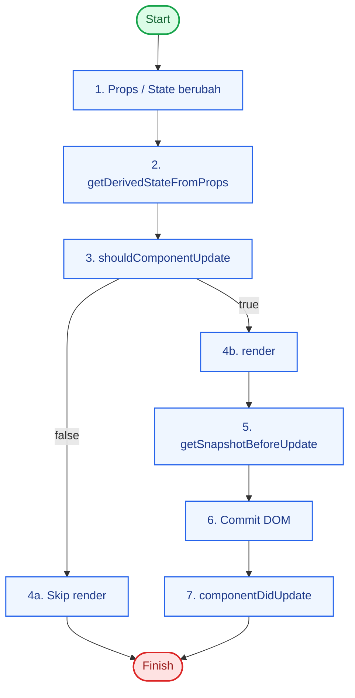

# Updating Lifecycle (Class Component)

Fase updating berjalan saat props atau state berubah.

## Pemicu Update

1. Props baru dari parent.
2. `setState()` dipanggil.
3. `forceUpdate()` dipanggil.

## Urutan Updating

1. `getDerivedStateFromProps`
2. `shouldComponentUpdate`
3. `render`
4. `getSnapshotBeforeUpdate`
5. `componentDidUpdate`

## Diagram Updating



## Kapan Pakai Method Ini

- `shouldComponentUpdate`: optimasi render.
- `getSnapshotBeforeUpdate`: baca data DOM lama sebelum commit.
- `componentDidUpdate`: side effect setelah update (misalnya fetch berdasarkan props baru).

## Contoh Guard di componentDidUpdate

```tsx
componentDidUpdate(prevProps: Props) {
  if (prevProps.userId !== this.props.userId) {
    this.fetchUser(this.props.userId);
  }
}
```
