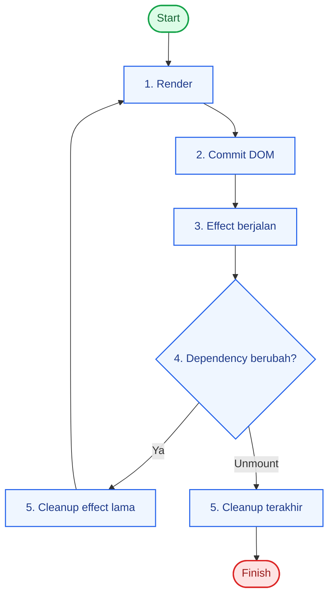
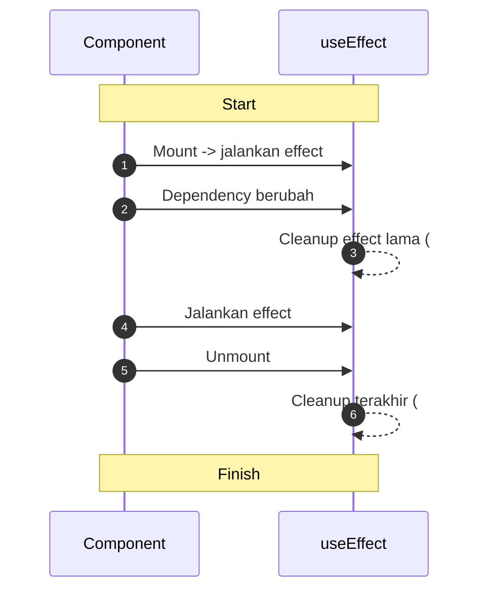

# useEffect: Side Effect dan Cleanup

`useEffect` dipakai untuk menjalankan side effect setelah render.

## Pola Eksekusi

- `useEffect(..., [])`: saat mount.
- `useEffect(..., [dep])`: saat mount + setiap `dep` berubah.
- `useEffect(...)`: setiap render.

## Diagram useEffect



## Bedanya `cleanup effect lama` vs `cleanup terakhir`

### 1. Cleanup effect lama

- Terjadi saat komponen **masih hidup** dan effect akan dijalankan ulang.
- Pemicu: dependency berubah (misalnya `query` dari `"rea"` jadi `"react"`).
- Tujuan: membersihkan efek sebelumnya supaya tidak bentrok dengan efek baru.

Contoh kasus:
- Membersihkan `setTimeout` debounce lama sebelum membuat timeout baru.
- Melepas event listener lama sebelum memasang listener baru.

### 2. Cleanup terakhir

- Terjadi saat komponen **akan unmount** (keluar dari tree).
- Pemicu: halaman berpindah, conditional render jadi `false`, atau parent unmount.
- Tujuan: memastikan tidak ada efek yang tertinggal setelah komponen hilang.

Contoh kasus:
- `clearInterval` timer.
- `unsubscribe` websocket/subscription.
- `abort` request yang masih berjalan.

## Timeline Singkat



## Contoh Cleanup

```tsx
useEffect(() => {
  const id = setInterval(() => {
    console.log("tick");
  }, 1000);

  return () => clearInterval(id);
}, []);
```

## Checklist

- Selalu cleanup listener/timer/subscription.
- Dependency harus lengkap.
- Hindari race condition untuk request async (pakai `AbortController`).
