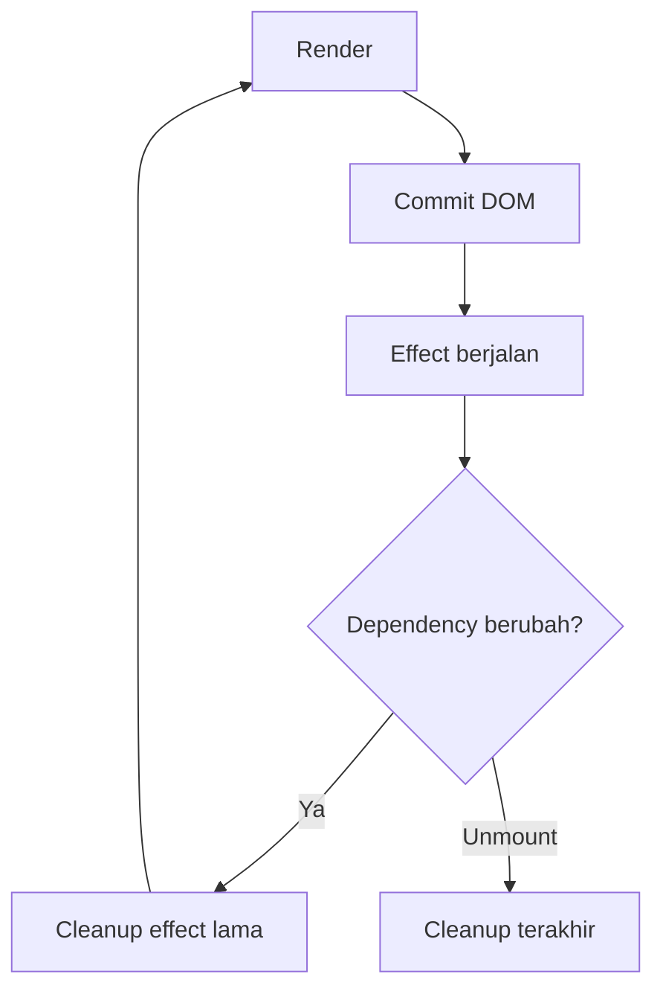

# useEffect: Side Effect dan Cleanup

`useEffect` dipakai untuk menjalankan side effect setelah render.

## Pola Eksekusi

- `useEffect(..., [])`: saat mount.
- `useEffect(..., [dep])`: saat mount + setiap `dep` berubah.
- `useEffect(...)`: setiap render.

## Diagram useEffect



## Contoh Cleanup

```tsx
useEffect(() => {
  const id = setInterval(() => {
    console.log("tick");
  }, 1000);

  return () => clearInterval(id);
}, []);
```

## Checklist

- Selalu cleanup listener/timer/subscription.
- Dependency harus lengkap.
- Hindari race condition untuk request async (pakai `AbortController`).
