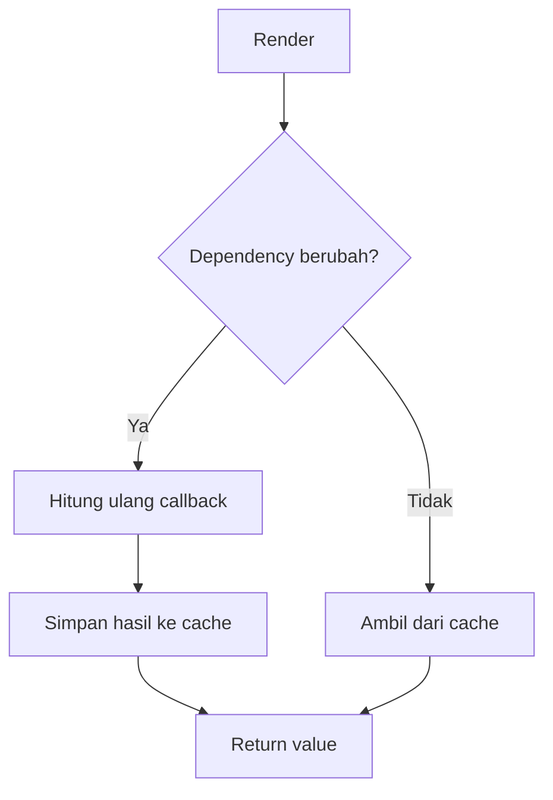
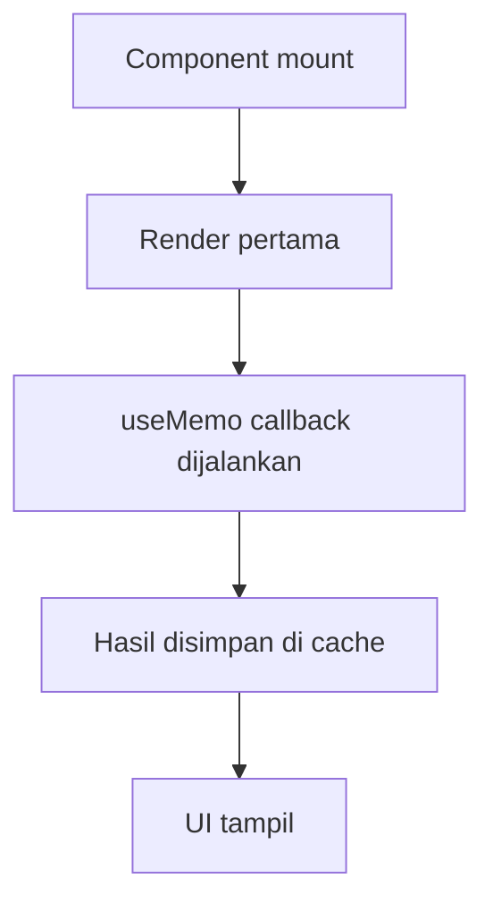
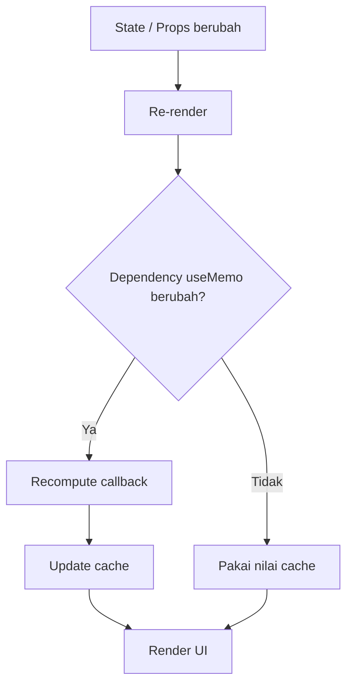
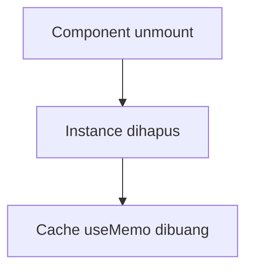

# useMemo untuk Optimasi

`useMemo` menyimpan hasil komputasi agar tidak dihitung ulang di setiap render.

## Kapan Perlu

- Kalkulasi berat.
- Filter/sort data besar.
- Menjaga nilai turunan tetap stabil.

## Diagram useMemo



## Lifecycle `useMemo`: Mounting, Updating, Unmounting

### 1. Mounting

Saat komponen pertama kali render, callback `useMemo` dieksekusi untuk membuat nilai awal.



### 2. Updating

Saat re-render, React membandingkan dependency:
- Jika berubah: callback dijalankan ulang.
- Jika sama: nilai diambil dari cache.



### 3. Unmounting

Saat komponen unmount, cache `useMemo` ikut dibuang bersama instance komponen.



## Penjelasan Praktis

- `useMemo` bukan pengganti state, tapi cache perhitungan.
- `useMemo` hanya membantu performa jika komputasinya memang cukup mahal.
- Dependency harus benar agar hasil tidak stale.
- Ketika komponen di-mount ulang, cache dihitung dari awal lagi.

## Contoh

```tsx
const filteredUsers = useMemo(() => {
  return users.filter((u) => u.name.includes(keyword));
}, [users, keyword]);
```

## Catatan

- Jangan pakai `useMemo` untuk semua hal.
- Nilai sederhana biasanya tidak butuh memo.
- Dependency harus benar, kalau tidak hasil bisa stale.
