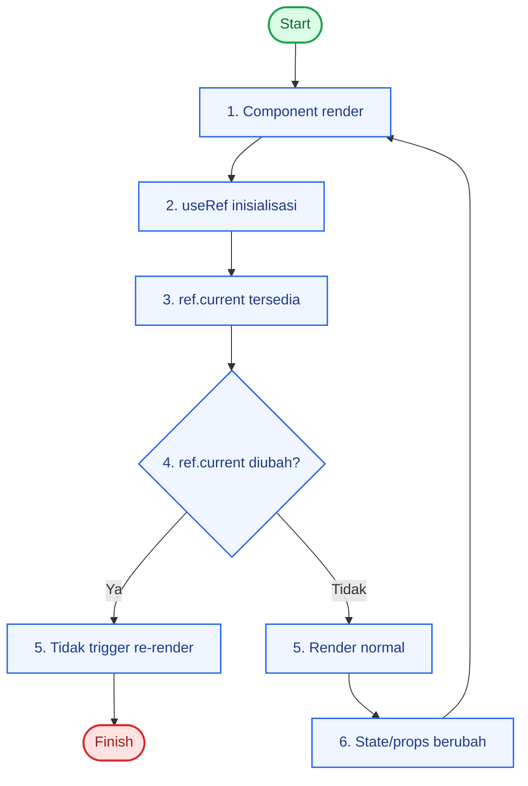

# useRef: Referensi DOM dan Nilai Mutable

`useRef` dipakai untuk menyimpan nilai yang tetap bertahan antar render tanpa memicu re-render saat nilainya berubah.

## Kegunaan Utama

1. Akses elemen DOM langsung (focus, scroll, select).
2. Simpan nilai mutable (counter internal, timer id, cache ringan).
3. Simpan nilai sebelumnya (previous value).

## Diagram Alur useRef



## Pola Dasar

### 1. Ref ke DOM

```tsx
const inputRef = useRef<HTMLInputElement | null>(null);

const focusInput = () => {
  inputRef.current?.focus();
};
```

### 2. Menyimpan previous value

```tsx
const prevCountRef = useRef<number | null>(null);

useEffect(() => {
  prevCountRef.current = count;
}, [count]);
```

### 3. Menyimpan nilai mutable

```tsx
const renderCountRef = useRef(0);

useEffect(() => {
  renderCountRef.current += 1;
});
```

## Perbedaan `useState` vs `useRef`

| Hook | Saat berubah memicu re-render? | Cocok untuk |
| --- | --- | --- |
| `useState` | Ya | Data yang memengaruhi UI |
| `useRef` | Tidak | Referensi DOM / nilai internal |

## Checklist

- Gunakan `useRef` jika butuh data persisten tapi tidak perlu render ulang.
- Gunakan `useState` jika perubahan nilai harus tampil ke UI.
- Hindari menyimpan seluruh state UI di `useRef`.
