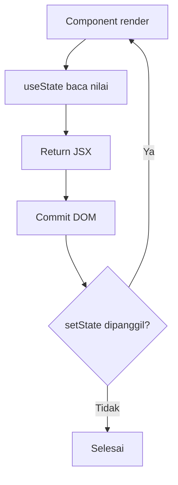

# useState dan Lifecycle Render

`useState` menyimpan state lokal di function component.

## Alur Singkat

1. Render dipanggil.
2. `useState` memberi nilai state saat ini.
3. UI dirender.
4. Saat `setState` dipanggil, React menjadwalkan re-render.

## Diagram Render + useState



## Contoh

```tsx
const [count, setCount] = useState(0);

<button onClick={() => setCount((c) => c + 1)}>Tambah</button>
```

## Catatan

- Update state bersifat async.
- Gunakan functional update jika nilai baru tergantung nilai lama.
