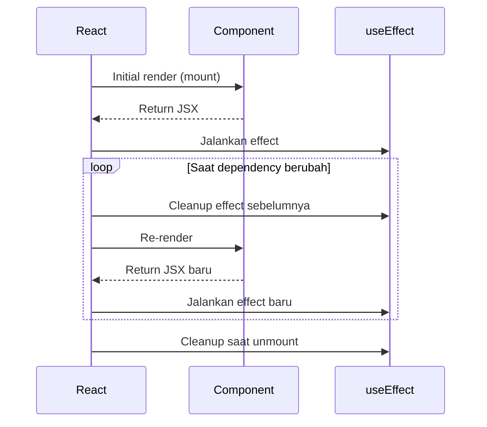

# Lifecycle Hooks (Cheat Sheet)

Dokumen ringkas untuk memahami lifecycle pada function component React.

## Fase Utama

1. Mount: komponen pertama kali tampil.
2. Update: state atau props berubah.
3. Unmount: komponen dilepas dari tree.

## Diagram Lifecycle Hooks



### Penjelasan Diagram

1. `Initial render (mount)` -> React memanggil komponen pertama kali.
2. `Return JSX` -> komponen mengembalikan tampilan.
3. `Jalankan effect` -> `useEffect` dieksekusi setelah render commit.
4. Saat dependency berubah:
   - React menjalankan `Cleanup effect sebelumnya`.
   - React melakukan `Re-render`.
   - React menjalankan `Effect baru`.
5. Saat komponen dihapus, React menjalankan `Cleanup saat unmount`.

### Mapping Fase

- `Mounting`: initial render + effect pertama.
- `Updating`: cleanup lama -> render ulang -> effect baru (ketika dependency berubah).
- `Unmounting`: cleanup terakhir saat komponen keluar dari tree.

## Pola Dasar

### Mount

```tsx
useEffect(() => {
  console.log("mounted");
}, []);
```

### Update

```tsx
useEffect(() => {
  console.log("count berubah", count);
}, [count]);
```

### Unmount + Cleanup

```tsx
useEffect(() => {
  const id = setInterval(() => {}, 1000);

  return () => clearInterval(id);
}, []);
```

## Checklist Aman

- Tambahkan cleanup untuk listener, timer, dan subscription.
- Isi dependency array dengan nilai yang benar.
- Hindari side effect langsung di body component.
