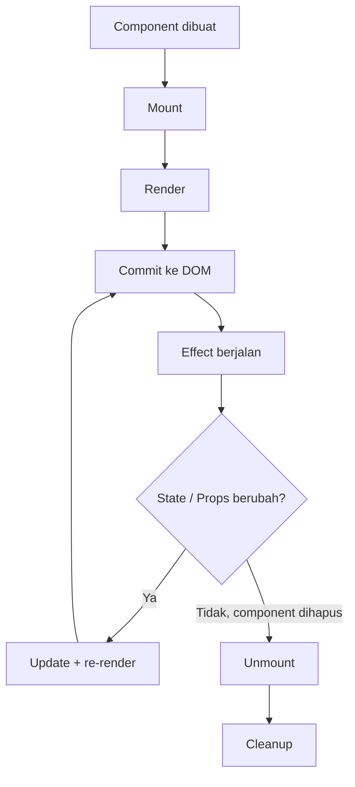

# React Basic - Lifecycle Learning Notes

Repository ini berisi materi belajar React lifecycle untuk:
- Class Component
- Function Component (Hooks)

## Struktur Dokumentasi

- `doc/react-lifecycle-overview.md`: peta besar lifecycle React.
- `doc/lifecycle-hooks-cheat-sheet.md`: ringkasan cepat lifecycle hooks.
- `doc/class-component-lifecycle.md`: gambaran lifecycle class component.
- `doc/class-component-mounting.md`: detail fase mounting.
- `doc/class-component-updating.md`: detail fase updating.
- `doc/function-usestate-lifecycle.md`: alur render dan `useState`.
- `doc/function-useeffect-guide.md`: pola `useEffect` dan cleanup.
- `doc/function-useref-guide.md`: penggunaan `useRef` untuk DOM dan nilai mutable.
- `doc/function-usememo-guide.md`: optimasi dengan `useMemo`.

## Urutan Presentasi (Rekomendasi)

1. `doc/react-lifecycle-overview.md`
2. `doc/lifecycle-hooks-cheat-sheet.md`
3. `doc/class-component-lifecycle.md`
4. `doc/class-component-mounting.md`
5. `doc/class-component-updating.md`
6. `doc/function-usestate-lifecycle.md`
7. `doc/function-useeffect-guide.md`
8. `doc/function-useref-guide.md`
9. `doc/function-usememo-guide.md`

## Peta Besar Lifecycle



### Penjelasan Diagram

1. `Component dibuat` -> React menyiapkan instance komponen.
2. `Mount` -> komponen pertama kali masuk ke tree UI.
3. `Render` -> React menjalankan function/class untuk menghasilkan JSX.
4. `Commit ke DOM` -> hasil render diterapkan ke DOM.
5. `Effect berjalan` -> `useEffect` dijalankan setelah commit.
6. `State / Props berubah?`
   - Jika **ya**: masuk ke `Update + re-render`, lalu commit ulang.
   - Jika **tidak** dan komponen dihapus: masuk ke `Unmount`.
7. `Unmount` -> komponen keluar dari tree.
8. `Cleanup` -> fungsi cleanup effect dijalankan (mis. clear interval, remove listener).

### Mapping Fase

- `Mounting`: dari `Component dibuat` sampai `Effect berjalan` pertama kali.
- `Updating`: loop `State / Props berubah?` -> `Update + re-render` -> `Commit`.
- `Unmounting`: `Unmount` -> `Cleanup`.

## Menjalankan Project

```bash
npm install
npm run dev
```

Buka `http://localhost:3000`.

## Halaman Demo

- `/learn-lifecycle/lifecycle-hooks`
- `/learn-lifecycle/02-function-component/02-useEffect`

## Catatan

Dokumen menggunakan format ringkas agar mudah dipakai sebagai catatan belajar dan referensi saat praktik.
